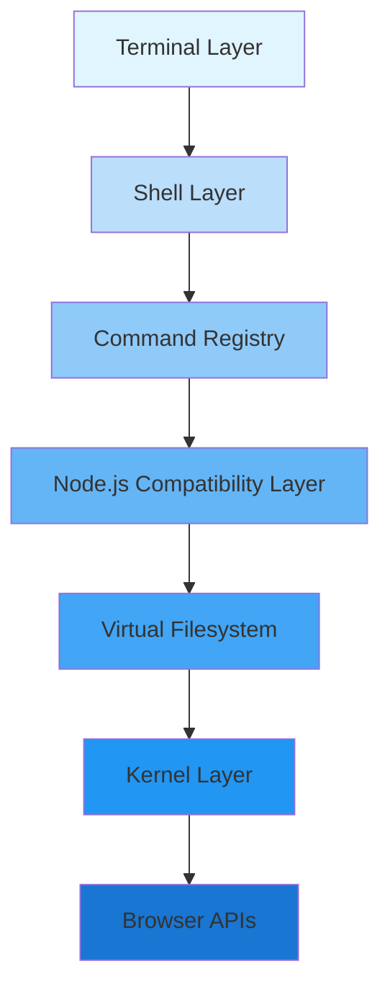

Lifo reimagines Unix by making the browser runtime the kernel. This inverts the traditional OS architecture: instead of an operating system providing APIs to applications, Lifo provides Unix-like APIs on top of browser primitives.

## High-Level Architecture

Lifo is organized as a stack of layers, each building on the one below:



## Layer Responsibilities

### Terminal Layer

The terminal handles raw user input/output using [xterm.js](https://xtermjs.org/). It provides:

- Character-by-character input processing
- ANSI escape sequence rendering
- Terminal emulation (VT100/xterm-256color)

The terminal implements the `ITerminal` interface and can be either visual (attached to a DOM element) or headless (for programmatic use).

### Shell Layer

The shell is a full POSIX-like command interpreter with:

- **Lexer**: Tokenizes input, handles quotes, escapes, variables, and command substitution
- **Parser**: Builds an AST from tokens, supporting compound commands (if/for/while/case)
- **Interpreter**: Executes the AST, managing pipes, redirections, and background jobs
- **Line editing**: Cursor movement, history navigation, tab completion
- **Job control**: Background jobs (`&`), job table, `fg`/`bg` builtins

See [Shell](/concepts/shell) for implementation details.

### Command Registry

The command registry is a map from command names to implementations. Commands are async functions that receive a `CommandContext`:

```typescript
export interface CommandContext {
  args: string[];           // Command arguments
  env: Record<string, string>;  // Environment variables
  cwd: string;              // Current working directory
  vfs: VFS;                 // Filesystem access
  stdout: CommandOutputStream;  // Standard output
  stderr: CommandOutputStream;  // Standard error
  signal: AbortSignal;      // Cancellation signal (Ctrl+C)
  stdin?: CommandInputStream;   // Standard input
  setRawMode?: (enabled: boolean) => void;  // For interactive commands
}

export type Command = (ctx: CommandContext) => Promise<number>;  // Exit code
```

Lifo includes 80+ Unix commands: `ls`, `cat`, `grep`, `sed`, `awk`, `tar`, `git`, `npm`, `node`, and more.

<Note>
Commands can be dynamically registered at runtime, making Lifo extensible. The `lifo` package manager installs commands by writing them to `/usr/share/pkg/node_modules` and updating the registry.
</Note>

### Node.js Compatibility Layer

Lifo provides shims for Node.js core modules, allowing unmodified npm packages to run:

- `fs` - Delegates to VFS
- `path` - POSIX path utilities
- `process` - Environment variables, argv, cwd, exit codes
- `stream` - Readable/Writable streams
- `buffer` - Uint8Array-based Buffer implementation
- `http` - Virtual HTTP server using the port registry
- `crypto` - Backed by Web Crypto API
- `events` - EventEmitter implementation

When bundling with tools like esbuild or Rollup, configure them to leave these imports unresolved:

```javascript
// esbuild example
esbuild.build({
  external: ['fs', 'path', 'process'],
  // ...
});
```

At runtime, Lifo's import map resolves these to the compatibility layer.

### Virtual Filesystem (VFS)

The VFS provides a Unix-like filesystem tree:

- **INodes**: In-memory directory tree with files and directories
- **Mount system**: Overlay external data sources at any path
- **Persistence**: Automatic save/restore via IndexedDB
- **Large file support**: Files ≥1MB are chunked into a content-addressable store
- **Virtual providers**: Dynamic filesystems (e.g., `/proc`, `/dev`)

See [Virtual Filesystem](/concepts/virtual-filesystem) for details.

### Kernel Layer

The kernel coordinates the system and provides core services:

```typescript
export class Kernel {
  vfs: VFS;                                      // Filesystem
  portRegistry: Map<number, VirtualRequestHandler>;  // HTTP port mapping
  private persistence: PersistenceManager;       // Save/restore state

  async boot(options?: { persist?: boolean }): Promise<void>
  initFilesystem(): void                         // Create standard directories
  getDefaultEnv(): Record<string, string>        // Default environment
}
```

Responsibilities:

- **Boot sequence**: Initialize VFS, restore persisted state, mount virtual providers
- **Filesystem initialization**: Create `/bin`, `/etc`, `/home`, `/tmp`, `/var`, `/usr`
- **Port registry**: Map TCP ports to JavaScript request handlers for the `http` module
- **Persistence**: Debounced filesystem snapshots to IndexedDB

See [Kernel](/concepts/kernel) for implementation details.

### Browser APIs (The Real Kernel)

At the bottom of the stack, browser APIs provide the primitives:

- **IndexedDB**: Persistent storage
- **Web Crypto**: Cryptographic operations
- **Web Workers**: (future) Process isolation
- **Service Workers**: (future) Network interception
- **localStorage/sessionStorage**: Configuration
- **fetch**: Network access

<Info>
By treating the browser as the kernel, Lifo gains instant portability: it runs anywhere JavaScript runs (Chrome, Firefox, Safari, Node.js, Deno, Bun).
</Info>

## Data Flow Example: Running `ls -la`

Let's trace a command through the stack:

1. **Terminal**: User types `ls -la<Enter>`, terminal captures keypresses
2. **Shell**: Line buffer is passed to the shell's `executeLine()` method
3. **Lexer**: Tokenizes input into `[{kind: Word, value: 'ls'}, {kind: Word, value: '-la'}]`
4. **Parser**: Builds AST: `SimpleCommandNode { words: [['ls'], ['-la']] }`
5. **Interpreter**: 
   - Expands words (no variables/globs here)
   - Looks up `ls` in the command registry
   - Creates `CommandContext` with `args: ['-la']`, `cwd`, `vfs`, etc.
   - Calls `ls(ctx)`
6. **ls command**:
   - Calls `ctx.vfs.readdirStat(ctx.cwd)`
   - Formats output with ANSI colors
   - Writes to `ctx.stdout`
7. **Interpreter**: Captures exit code, returns to shell
8. **Shell**: Prints prompt, waits for next command

## Pipes and Redirections

Pipes and redirections work at the interpreter level:

```bash
grep foo file.txt | wc -l > count.txt
```

- **Lexer/Parser**: Recognizes `|` and `>` operators
- **Interpreter**: 
  - Creates `PipeChannel` (in-memory buffer with reader/writer streams)
  - Runs `grep` with `stdout` = pipe writer
  - Runs `wc` with `stdin` = pipe reader, `stdout` = file writer for `count.txt`
  - Waits for both commands to complete

See [Shell - Pipes](/concepts/shell#pipes-and-redirections) for details.

## Sandbox: High-Level API

The `Sandbox` class provides a batteries-included API:

```typescript
import { Sandbox } from '@lifo/core';

const sandbox = await Sandbox.create({
  cwd: '/home/user/project',
  env: { DEBUG: '1' },
  files: {
    '/home/user/project/hello.txt': 'Hello, world!',
  },
});

// Run commands
const { stdout, exitCode } = await sandbox.commands.run('cat hello.txt');
console.log(stdout);  // "Hello, world!"

// Filesystem operations
await sandbox.fs.writeFile('/data.json', JSON.stringify({ x: 42 }));
const content = await sandbox.fs.readFile('/data.json', 'utf8');
```

See [Sandbox](/concepts/sandbox) for details.

## Performance Characteristics

### Memory

- **Filesystem tree**: Stored in-memory as JavaScript objects (INodes)
- **Small files (&lt;1MB)**: Stored inline as `Uint8Array` in INodes
- **Large files (≥1MB)**: Chunked into 256KB blocks in a `ContentStore` (Map)
- **Persistence overhead**: ~10-20% larger than raw data (JSON serialization)

### Execution

- **Command dispatch**: ~0.1ms (hash map lookup)
- **Pipe overhead**: ~0.5ms per pipe (in-memory stream setup)
- **VFS operations**: ~0.01-0.1ms (in-memory tree traversal)
- **Parser**: ~1ms per command (tokenize + parse)
- **IndexedDB save**: Debounced, ~50-200ms for full filesystem

### Scalability

- ✅ **10,000 files**: Works well
- ⚠️ **100,000 files**: Noticeable slowdown in `ls -R`, persistence
- ❌ **1,000,000 files**: Not recommended (memory pressure)

<Note>
For large-scale data processing, use the native filesystem mount feature to bypass in-memory VFS.
</Note>

## Extension Points

Lifo is designed for extensibility:

1. **Custom commands**: `registry.register('mycommand', async (ctx) => { ... })`
2. **Virtual providers**: `vfs.mount('/mymount', new MyProvider())`
3. **Native filesystem mounts**: `sandbox.mountNative('/project', '/host/path')`
4. **HTTP port handlers**: `kernel.portRegistry.set(3000, handler)`
5. **Custom builtins**: `shell.builtins.set('mybuiltin', fn)`

See [Custom Commands](/advanced/custom-commands) and [Virtual Providers](/advanced/virtual-providers) for examples.