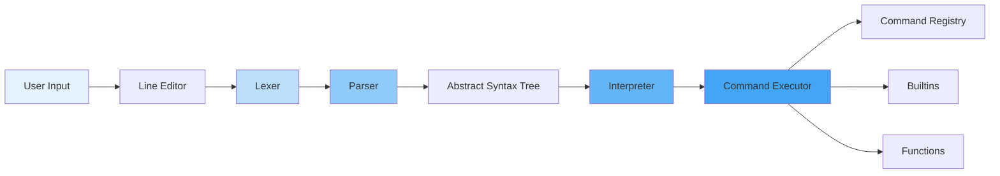

The `Shell` class is a full-featured POSIX-like command interpreter. It parses and executes shell scripts, handles pipes and redirections, manages background jobs, and provides interactive line editing.

## Class Definition

```typescript
export class Shell {
  private terminal: ITerminal;
  private vfs: VFS;
  private registry: CommandRegistry;
  private cwd: string;
  private env: Record<string, string>;
  private interpreter: Interpreter;
  private historyManager: HistoryManager;
  private jobTable: JobTable;
  private aliases: Map<string, string>;
  
  constructor(
    terminal: ITerminal,
    vfs: VFS,
    registry: CommandRegistry,
    env: Record<string, string>
  )
  
  // Execution
  async execute(cmd: string, options?: ExecuteOptions): Promise<{
    stdout: string;
    stderr: string;
    exitCode: number;
  }>
  
  start(): void  // Start interactive mode
  
  // Accessors
  getCwd(): string
  setCwd(cwd: string): void
  getEnv(): Record<string, string>
  getVfs(): VFS
  getRegistry(): CommandRegistry
  getJobTable(): JobTable
}
```

Location: `src/shell/Shell.ts:23`

## Architecture

The shell consists of multiple components working together:



### 1. Line Editor

Handles interactive input with:

- **Cursor movement**: Arrow keys, Home/End, Ctrl+A/E
- **History navigation**: Up/Down arrows
- **Tab completion**: Files, commands, arguments
- **Line editing**: Insert, delete, backspace
- **Ctrl+C**: Interrupt running command
- **Ctrl+D**: Send EOF to stdin
- **Ctrl+U**: Clear line

See `src/shell/Shell.ts:267-525`.

### 2. Lexer (Tokenizer)

The lexer converts raw input into tokens:

```typescript
const tokens = lex('ls -la | grep foo > output.txt');
// [
//   { kind: TokenKind.Word, value: 'ls' },
//   { kind: TokenKind.Word, value: '-la' },
//   { kind: TokenKind.Pipe, value: '|' },
//   { kind: TokenKind.Word, value: 'grep' },
//   { kind: TokenKind.Word, value: 'foo' },
//   { kind: TokenKind.RedirectOut, value: '>' },
//   { kind: TokenKind.Word, value: 'output.txt' },
//   { kind: TokenKind.EOF, value: '' }
// ]
```

Location: `src/shell/lexer.ts:3`

**Token types:**

- `Word` - Command names, arguments, filenames
- `Pipe` - `|`
- `And` - `&&`
- `Or` - `||`
- `Amp` - `&` (background)
- `Semi` - `;`
- `RedirectOut` - `>`
- `RedirectAppend` - `>>`
- `RedirectIn` - `<`
- `RedirectErr` - `2>`
- `RedirectErrAppend` - `2>>`
- `RedirectAll` - `&>`
- `Newline` - `\n`
- `LParen` / `RParen` - `(` / `)` (for subshells and functions)
- `DoubleSemi` - `;;` (case statement)

**Quote handling:**

```typescript
lex("echo 'hello world'");
// Word with parts: [{ text: 'hello world', quoted: 'single' }]

lex('echo "foo $VAR bar"');
// Word with parts: [{ text: 'foo $VAR bar', quoted: 'double' }]

lex('echo foo\\'bar');
// Word with parts: [{ text: 'foo'bar', quoted: 'none' }]
```

Each word token has a `parts` array tracking quoted/unquoted segments. This preserves quoting information for the expander.

See `src/shell/lexer.ts:145-282`.

### 3. Parser

The parser builds an Abstract Syntax Tree (AST) from tokens:

```typescript
const script = parse(tokens);
// ScriptNode {
//   type: 'script',
//   lists: [
//     ListNode {
//       type: 'list',
//       entries: [
//         {
//           pipeline: PipelineNode { ... },
//           connector: '&&'
//         },
//         { ... }
//       ],
//       background: false
//     }
//   ]
// }
```

Location: `src/shell/parser.ts:27`

**AST node types:**

- `ScriptNode` - Top-level (list of lists)
- `ListNode` - Command sequence with connectors (`&&`, `||`)
- `PipelineNode` - Pipeline of commands (`cmd1 | cmd2 | cmd3`)
- `SimpleCommandNode` - Single command with args, redirections, assignments
- `IfNode` - `if ... then ... elif ... else ... fi`
- `ForNode` - `for var in words; do ...; done`
- `WhileNode` / `UntilNode` - Loops
- `CaseNode` - Pattern matching
- `FunctionDefNode` - Function definition
- `GroupNode` - `{ ... }` command grouping

See `src/shell/types.ts` for full AST definitions.

**Example parse tree:**

```
Input: if test -f file.txt; then cat file.txt; fi

IfNode {
  clauses: [
    {
      condition: [
        ListNode {
          entries: [{ pipeline: SimpleCommandNode { words: [['test'], ['-f'], ['file.txt']] } }]
        }
      ],
      body: [
        ListNode {
          entries: [{ pipeline: SimpleCommandNode { words: [['cat'], ['file.txt']] } }]
        }
      ]
    }
  ],
  elseBody: null
}
```

### 4. Expander

The expander processes word parts before execution:

```typescript
const words = await expandWords(
  [[{ text: '$HOME/file.txt', quoted: 'none' }]],
  expandContext
);
// ['/home/user/file.txt']
```

Location: `src/shell/expander.ts`

**Expansion types:**

1. **Variable expansion**: `$VAR`, `${VAR}`, `$1`, `$@`, `$?`
2. **Tilde expansion**: `~` → `/home/user`, `~/docs` → `/home/user/docs`
3. **Command substitution**: `$(cmd)`, `\`cmd\``
4. **Glob expansion**: `*.txt`, `file[0-9].log`
5. **Brace expansion**: `{a,b,c}` → `a b c`

**Quoting rules:**

- Single quotes (`'...'`): No expansion
- Double quotes (`"..."`): Variable and command substitution, but no glob
- Unquoted: All expansions

**Example:**

```bash
VAR=world
echo 'Hello $VAR'        # Hello $VAR
echo "Hello $VAR"        # Hello world
echo Hello $VAR          # Hello world
echo *.txt               # file1.txt file2.txt
echo "*.txt"             # *.txt
```

### 5. Interpreter

The interpreter executes the AST:

```typescript
const exitCode = await interpreter.executeLine('ls -la | wc -l');
```

Location: `src/shell/interpreter.ts:70`

**Execution flow:**

1. Traverse AST nodes
2. For each simple command:
   - Expand words (variables, globs, command substitution)
   - Look up command (builtin → function → registry)
   - Set up stdin/stdout/stderr (pipes, redirections)
   - Execute command
   - Capture exit code
3. Handle control flow (`&&`, `||`, exit codes)
4. Return final exit code

See `src/shell/interpreter.ts:92-106` for `executeLine()`.

## Builtins

Builtins are commands implemented directly in the shell (not in the registry):

```typescript
this.builtins.set('cd', (args, _stdout, stderr) => this.builtinCd(args, stderr));
this.builtins.set('pwd', (_args, stdout) => this.builtinPwd(stdout));
this.builtins.set('echo', (args, stdout) => this.builtinEcho(args, stdout));
this.builtins.set('export', (args) => this.builtinExport(args));
this.builtins.set('alias', (args, stdout) => this.builtinAlias(args, stdout));
this.builtins.set('unalias', (args, _stdout, stderr) => this.builtinUnalias(args, stderr));
this.builtins.set('source', (args, _stdout, stderr) => this.builtinSource(args, stderr));
this.builtins.set('history', (_args, stdout) => this.builtinHistory(stdout));
this.builtins.set('jobs', (_args, stdout) => this.builtinJobs(stdout));
this.builtins.set('fg', (args, stdout, stderr) => this.builtinFg(args, stdout, stderr));
this.builtins.set('bg', (args, stdout, stderr) => this.builtinBg(args, stdout, stderr));
this.builtins.set('clear', () => this.builtinClear());
this.builtins.set('exit', (_args, stdout) => this.builtinExit(stdout));
this.builtins.set('true', () => Promise.resolve(0));
this.builtins.set('false', () => Promise.resolve(1));
this.builtins.set('test', (_args, _stdout, stderr) => ...);
this.builtins.set('[', (_args, _stdout, stderr) => ...);
```

See `src/shell/Shell.ts:98-119`.

**Why builtins?**

Some commands must be builtins because they modify shell state:

- `cd` - Changes `cwd` (process-local state)
- `export` - Sets environment variables
- `alias` - Defines command aliases
- `source` / `.` - Executes script in current shell context
- `exit` - Terminates the shell

## Pipes and Redirections

### Pipes

Pipes connect stdout of one command to stdin of the next:

```bash
ls -la | grep txt | wc -l
```

Implementation (`src/shell/interpreter.ts:177-208`):

1. Create `PipeChannel` instances (in-memory streams)
2. Run commands in parallel:
   - Command 1: stdin=none, stdout=pipe1.writer
   - Command 2: stdin=pipe1.reader, stdout=pipe2.writer
   - Command 3: stdin=pipe2.reader, stdout=terminal
3. Close pipe writers when commands finish
4. Wait for all commands to complete
5. Return exit code of last command

**PipeChannel implementation:**

```typescript
class PipeChannel {
  private buffer: string[] = [];
  private closed = false;
  private waiters: Array<(value: string | null) => void> = [];
  
  readonly writer: CommandOutputStream = {
    write: (text: string) => {
      if (this.closed) return;
      this.buffer.push(text);
      this.notifyWaiters();
    }
  };
  
  readonly reader: CommandInputStream = {
    read: async () => {
      if (this.buffer.length > 0) {
        return this.buffer.shift()!;
      }
      if (this.closed) {
        return null;  // EOF
      }
      // Wait for data
      return new Promise(resolve => this.waiters.push(resolve));
    },
    readAll: async () => { ... }
  };
  
  close() {
    this.closed = true;
    this.notifyWaiters();
  }
}
```

See `src/shell/pipe.ts`.

<Info>
Pipes are in-memory only. There's no buffering to disk, so very large pipes can cause memory pressure.
</Info>

### Redirections

Redirections change stdin/stdout/stderr for a command:

```bash
cat < input.txt         # Redirect stdin from file
ls > output.txt         # Redirect stdout to file (truncate)
ls >> output.txt        # Redirect stdout to file (append)
grep foo 2> errors.log  # Redirect stderr to file
cmd &> all.log          # Redirect both stdout and stderr
```

Implementation (`src/shell/interpreter.ts:435-468`):

1. Parser extracts redirection nodes from AST
2. Interpreter creates file readers/writers:
   - `>` / `>>` → Create `CommandOutputStream` that writes to VFS
   - `<` → Create `CommandInputStream` that reads from VFS
   - `2>` / `2>>` → Same for stderr
   - `&>` → Redirect both stdout and stderr to same file
3. Pass streams to command executor

**File reader/writer implementation:**

```typescript
private createFileWriter(path: string): CommandOutputStream {
  return {
    write: (text: string) => {
      this.config.vfs.writeFile(path, text);  // Overwrites each time
    },
  };
}

private createFileAppender(path: string): CommandOutputStream {
  return {
    write: (text: string) => {
      this.config.vfs.appendFile(path, text);
    },
  };
}

private createFileReader(path: string): CommandInputStream {
  const content = this.config.vfs.readFileString(path);
  let consumed = false;
  return {
    read: async () => {
      if (consumed) return null;
      consumed = true;
      return content;
    },
    readAll: async () => content,
  };
}
```

See `src/shell/interpreter.ts:626-653`.

## Job Control

The shell supports background jobs and job control:

```bash
sleep 10 &              # Run in background
# [1] (background)

jobs                    # List jobs
# [1] Running    sleep 10

fg 1                    # Bring job 1 to foreground
bg 1                    # Resume job 1 in background (future)
```

### JobTable

The `JobTable` manages background jobs:

```typescript
class JobTable {
  private jobs: Map<number, Job> = new Map();
  private nextId = 1;
  
  add(command: string, promise: Promise<number>, abort: AbortController): number;
  get(id: number): Job | undefined;
  remove(id: number): void;
  list(): Job[];
  collectDone(): Job[];  // Get finished jobs
}

interface Job {
  id: number;
  command: string;
  status: 'running' | 'done';
  promise: Promise<number>;
  abortController: AbortController;
}
```

See `src/shell/jobs.ts`.

### Background Execution

When a command ends with `&`, the interpreter:

1. Spawns the command asynchronously
2. Adds it to the job table
3. Immediately returns (doesn't wait)
4. Prints job ID

See `src/shell/interpreter.ts:110-122`.

**Example:**

```typescript
const list: ListNode = {
  type: 'list',
  entries: [{ pipeline: ... }],
  background: true
};

const promise = this.executeListEntries(list.entries);
const jobId = this.jobTable.add(commandText, promise, abortController);
this.writeToTerminal(`[${jobId}] (background)\n`);
return 0;  // Immediately
```

### Finished Job Notification

The shell checks for finished jobs before each prompt:

```typescript
private printPrompt(): void {
  const doneJobs = this.jobTable.collectDone();
  for (const job of doneJobs) {
    this.writeToTerminal(`[${job.id}] Done    ${job.command}\n`);
  }
  // ... print prompt
}
```

See `src/shell/Shell.ts:247-252`.

## History

The shell maintains command history with expansion support:

### HistoryManager

```typescript
class HistoryManager {
  private entries: string[] = [];
  
  constructor(private vfs: VFS)
  
  load(): void;                    // Load from ~/.lifo_history
  save(): void;                    // Save to ~/.lifo_history
  add(entry: string): void;        // Add entry (auto-saves)
  getAll(): string[];              // Get all entries
  expand(line: string): string | null;  // History expansion (!!, !N, !prefix)
}
```

See `src/shell/history.ts`.

### History Expansion

Supports bash-like history expansion:

```bash
history
# 1  ls -la
# 2  cd /tmp
# 3  cat file.txt

!!        # Repeat last command (cat file.txt)
!2        # Repeat command 2 (cd /tmp)
!ls       # Repeat last command starting with 'ls'
```

Implementation (`src/shell/history.ts:40-79`):

1. Check if line starts with `!`
2. Parse expansion type (`!!`, `!N`, `!prefix`)
3. Look up command in history
4. Return expanded command

The shell displays the expanded command before executing:

```typescript
const expanded = this.historyManager.expand(line);
if (expanded !== null) {
  this.writeToTerminal(expanded + '\n');  // Show what's being run
}
```

See `src/shell/Shell.ts:631-637`.

## Tab Completion

The shell provides context-aware tab completion:

```bash
ls ~/doc<TAB>      # Completes to ~/docs/
cat file<TAB>      # Shows: file1.txt  file2.txt
gr<TAB>            # Completes to grep
```

### Completer

```typescript
function complete(ctx: CompletionContext): CompletionResult {
  // Returns completions for the word at cursor
}

interface CompletionContext {
  line: string;
  cursorPos: number;
  cwd: string;
  env: Record<string, string>;
  vfs: VFS;
  registry: CommandRegistry;
  builtinNames: string[];
}

interface CompletionResult {
  completions: string[];
  replacementStart: number;
  replacementEnd: number;
  commonPrefix: string;
}
```

See `src/shell/completer.ts`.

**Completion logic:**

1. Determine word at cursor (handle quotes, escapes)
2. If first word → complete command names (builtins + registry)
3. Otherwise → complete file paths
4. If multiple matches, find common prefix
5. Return matches

**Tab behavior:**

- First tab: Insert common prefix (if any)
- Second tab: Show all completions

See `src/shell/Shell.ts:394-444`.

## Aliases

Aliases allow defining command shortcuts:

```bash
alias ll='ls -la'
alias ..='cd ..'
alias g='git'

ll              # Expands to: ls -la
g status        # Expands to: git status
```

### Implementation

```typescript
private aliases = new Map<string, string>();

// Define alias
this.aliases.set('ll', 'ls -la');

// Expand alias during execution
const aliasValue = aliases.get(name);
if (aliasValue !== undefined) {
  const expandedLine = aliasValue + (args.length > 0 ? ' ' + args.join(' ') : '');
  return this.executeLine(expandedLine);
}
```

See `src/shell/interpreter.ts:407-415`.

Aliases are persisted in `~/.liforc`:

```bash
alias ll='ls -la'
alias g='git'
```

## Control Flow Constructs

The shell supports full POSIX control flow:

### If Statements

```bash
if test -f file.txt; then
  cat file.txt
elif test -d dir; then
  ls dir
else
  echo "Not found"
fi
```

See `src/shell/interpreter.ts:236-254`.

### For Loops

```bash
for file in *.txt; do
  echo "Processing $file"
  cat "$file"
done

for i in 1 2 3; do echo $i; done

for arg; do echo $arg; done  # Iterate over $@
```

See `src/shell/interpreter.ts:256-288`.

### While Loops

```bash
while test -f flag.txt; do
  echo "Waiting..."
  sleep 1
done
```

See `src/shell/interpreter.ts:290-313`.

### Case Statements

```bash
case $1 in
  start)
    echo "Starting..."
    ;;
  stop)
    echo "Stopping..."
    ;;
  *)
    echo "Usage: $0 {start|stop}"
    ;;
esac
```

See `src/shell/interpreter.ts:342-359`.

### Functions

```bash
greet() {
  echo "Hello, $1!"
}

greet World  # Hello, World!
```

See `src/shell/interpreter.ts:362-365` and `src/shell/interpreter.ts:552-593`.

## Programmatic Execution

The shell can be used programmatically (headless mode):

```typescript
const result = await shell.execute('ls -la', {
  cwd: '/home/user',
  env: { DEBUG: '1' },
  stdin: 'input data',
  onStdout: (data) => console.log('OUT:', data),
  onStderr: (data) => console.log('ERR:', data),
});

console.log(result.stdout);   // Captured output
console.log(result.exitCode); // 0
```

See `src/shell/Shell.ts:149-215`.

**Features:**

- Captured stdout/stderr
- Custom stdin
- Per-call cwd/env overrides
- Streaming callbacks

This is used by the Sandbox API and the `npm` command.

## Configuration Files

The shell sources configuration files on startup:

1. `/etc/profile` - System-wide configuration
2. First of:
   - `~/.liforc` - Lifo shell config (preferred)
   - `~/.bashrc` - Bash compatibility
   - `~/.profile` - Generic shell config

See `src/shell/Shell.ts:226-244`.

## Special Variables

The shell maintains special variables:

- `$HOME` - User home directory
- `$USER` - Username
- `$HOSTNAME` - System hostname
- `$SHELL` - Shell path
- `$PATH` - Command search path
- `$TERM` - Terminal type
- `$PWD` - Current working directory
- `$OLDPWD` - Previous working directory (for `cd -`)
- `$?` - Last exit code
- `$#` - Number of positional parameters
- `$@` - All positional parameters
- `$1`, `$2`, ... - Individual positional parameters

## Related

- [Architecture](/concepts/architecture#shell-layer) - Shell in system architecture
- [Sandbox](/concepts/sandbox) - High-level API that uses Shell
- [Commands](/guides/commands) - Writing custom commands